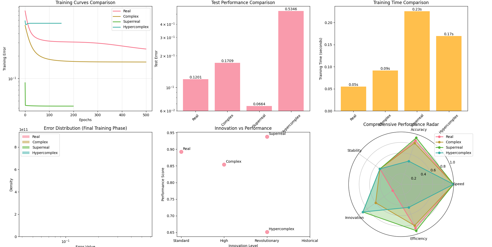
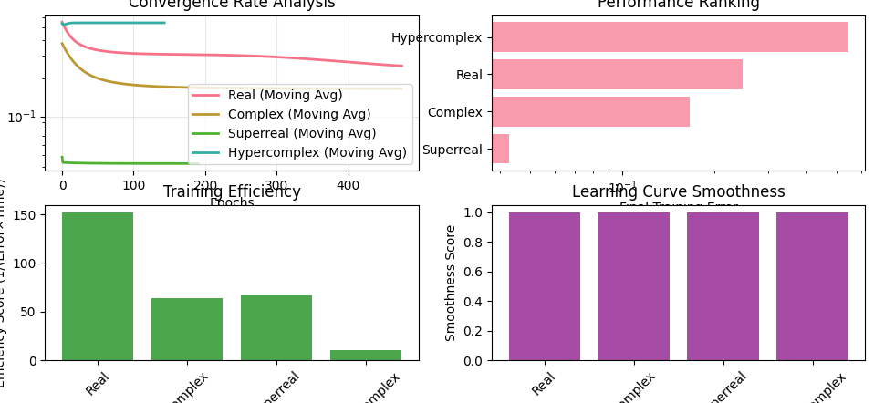
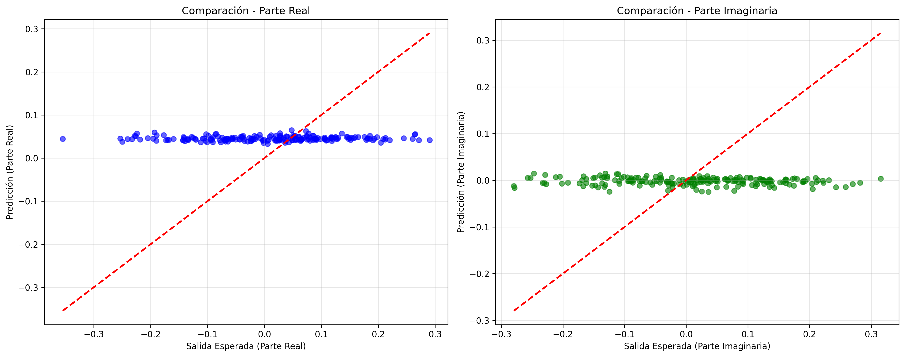
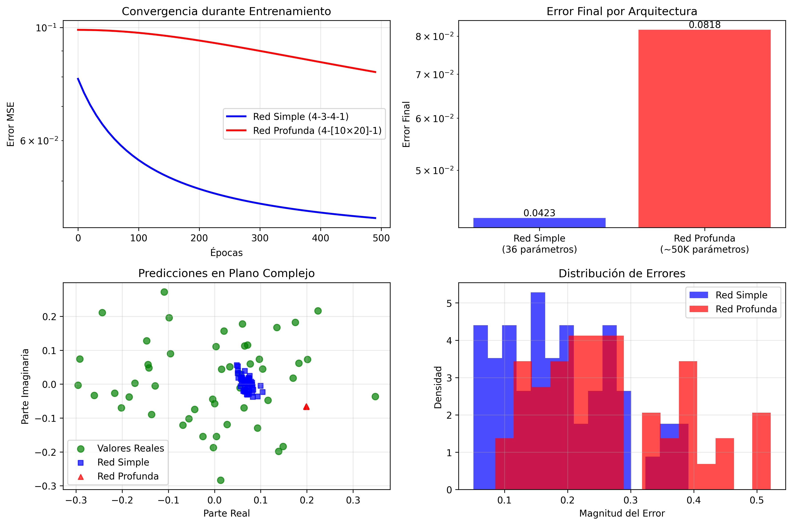
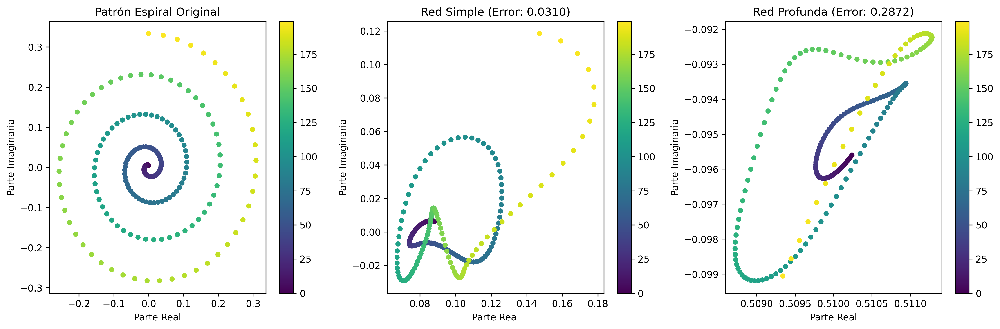
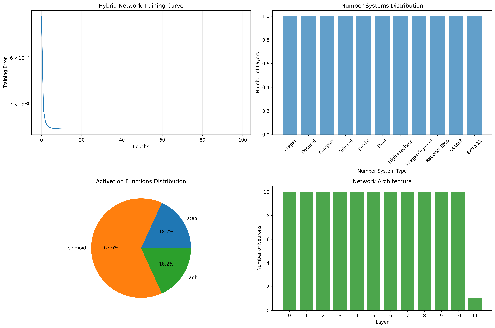
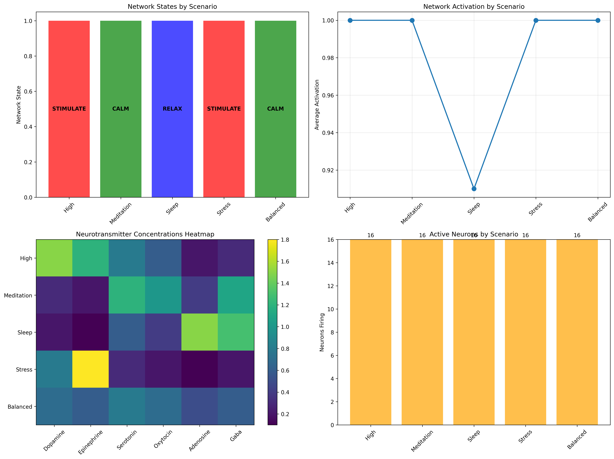

# Complete Documentation: Alternative Neural Networks

## Table of Contents

0. [Authors](#authors)
1. [Project Overview](#project-overview)
2. [Installation Guide](#installation-guide)
3. [Module Documentation](#module-documentation)
4. [Biochemical Neural Algebra](#biochemical-neural-algebra)
5. [Generated Visualizations](#generated-visualizations)
6. [Study Guide](#study-guide)

## Authors

This project was developed by:

- **Marco Baturan** 
  GitHub: [@marcobaturan](https://github.com/marcobaturan)

- **Roman Sitelew**   GitHub: [@romansitelew](https://github.com/RomanPlusPlus)


## Project Overview

This research project investigates alternative neural network architectures that operate beyond traditional real-valued computation. The exploration encompasses mathematical number systems and biochemical modeling to understand the nature and potential of alternative neural computation paradigms.

## Installation Guide

### Environment Setup

```bash
# Create isolated virtual environment
python -m venv neural_networks_research

# Activate environment (Windows)
neural_networks_research\Scripts\activate

# Activate environment (macOS/Linux)  
source neural_networks_research/bin/activate

# Upgrade pip
python -m pip install --upgrade pip
```

### Dependencies Installation

```bash
# Core mathematical dependencies
pip install numpy>=1.21.0 matplotlib>=3.5.0 pandas>=1.3.0

# Interactive interface dependencies
pip install streamlit>=1.28.0 plotly>=5.15.0 seaborn>=0.11.0

# Or use requirements files
pip install -r requirements.txt
pip install -r requirements_streamlit.txt
```

### Verification

```bash
# Test basic installation
python -c "import numpy, matplotlib, pandas; print('Core dependencies installed')"

# Test Streamlit installation
python -m streamlit --version
```

## Module Documentation

### Mathematical Neural Networks

#### `red_neuronal_compleja.py`

**Purpose**: Implements neural networks operating with complex number arithmetic.

**Class: `RedNeuronalCompleja`**

```python
class RedNeuronalCompleja:
    """
    Neural network implementation using complex number arithmetic.
    
    This class extends traditional neural networks by operating entirely
    in the complex number domain, allowing for richer representational
    capacity through the use of both real and imaginary components.
    """
    
    def __init__(self, arquitectura: List[int], tasa_aprendizaje: float = 0.1):
        """
        Initialize complex neural network.
        
        Args:
            arquitectura: List defining neurons per layer [input, hidden..., output]
            tasa_aprendizaje: Learning rate for training process
        """
```

**Key Methods:**

##### `sigmoide_compleja(self, z: np.ndarray) -> np.ndarray`
```python
def sigmoide_compleja(self, z: np.ndarray) -> np.ndarray:
    """
    Complex sigmoid activation function.
    
    For complex number z = a + bi, applies:
    σ(z) = σ(a) × cos(b) + i × σ(a) × sin(b)
    
    This formulation preserves the complex structure while providing
    a meaningful activation that respects both real and imaginary components.
    
    Args:
        z: Complex-valued input array
        
    Returns:
        Complex-valued activated output
    """
    parte_real = np.real(z)  # Extract real component
    parte_imag = np.imag(z)  # Extract imaginary component
    
    # Apply sigmoid to real part
    sigmoide_real = 1 / (1 + np.exp(-np.clip(parte_real, -500, 500)))
    
    # Construct complex result
    resultado_real = sigmoide_real * np.cos(parte_imag)
    resultado_imag = sigmoide_real * np.sin(parte_imag)
    
    return resultado_real + 1j * resultado_imag
```

##### `propagacion_adelante(self, entrada: np.ndarray)`
```python
def propagacion_adelante(self, entrada: np.ndarray):
    """
    Forward propagation through complex network.
    
    Performs matrix multiplication and activation in complex domain:
    z^(l) = W^(l) × a^(l-1) + b^(l)
    a^(l) = σ_complex(z^(l))
    
    Args:
        entrada: Complex-valued input data
        
    Returns:
        Tuple of (activations, z_values) for each layer
    """
```

#### `numeros_surreales.py`

**Purpose**: Implementation of Conway's surreal number system for neural computation.

**Class: `NumeroSurreal`**

```python
class NumeroSurreal:
    """
    Implementation of Conway's surreal numbers.
    
    Surreal numbers are defined recursively as {L|R} where:
    - L is a set of surreal numbers (left set)
    - R is a set of surreal numbers (right set)  
    - No element of L is ≥ any element of R
    
    This implementation uses approximations to avoid infinite recursion
    while preserving the essential mathematical properties.
    """
    
    def __init__(self, izquierda: Set['NumeroSurreal'] = None, 
                 derecha: Set['NumeroSurreal'] = None, nombre: str = None):
        """
        Initialize surreal number.
        
        Args:
            izquierda: Left set (numbers less than this surreal)
            derecha: Right set (numbers greater than this surreal)
            nombre: Optional descriptive name
        """
        self.L = izquierda if izquierda is not None else set()
        self.R = derecha if derecha is not None else set()
        self.nombre = nombre
```

**Key Methods:**

##### `__le__(self, otro: 'NumeroSurreal') -> bool`
```python
def __le__(self, otro: 'NumeroSurreal') -> bool:
    """
    Surreal number ordering comparison.
    
    x ≤ y if and only if:
    - No element l ∈ L_x satisfies y ≤ l, AND
    - No element r ∈ R_y satisfies r ≤ x
    
    This implements Conway's recursive definition of surreal ordering.
    """
    # Check condition 1: no l in L_x such that otro <= l
    for l in self.L:
        if otro <= l:
            return False
    
    # Check condition 2: no r in R_otro such that r <= self
    for r in otro.R:
        if r <= self:
            return False
    
    return True
```

#### `biochemical_neural_system.py`

**Purpose**: Symbolic biochemical neural network implementation.

**Class: `ChemoReceptor`**

```python
class ChemoReceptor:
    """
    Models biological neurotransmitter receptors.
    
    Chemo-receptors are specialized proteins that bind specific
    neurotransmitters and convert chemical signals into electrical
    responses. This implementation models the binding kinetics
    and activation characteristics.
    """
    
    def bind_neurotransmitter(self, concentration: NeurotransmitterConcentration) -> float:
        """
        Simulate neurotransmitter binding and receptor activation.
        
        The binding follows Michaelis-Menten-like kinetics with
        a sigmoid activation curve that models receptor saturation.
        
        Mathematical model:
        activation = 1 / (1 + exp(-sensitivity × (concentration - threshold) × 5))
        
        Args:
            concentration: Current neurotransmitter concentrations
            
        Returns:
            Activation level [0.0, 1.0]
        """
        # Extract relevant neurotransmitter concentration
        nt_concentration = getattr(concentration, self.receptor_type.value)
        
        # Apply biological threshold
        if nt_concentration < self.threshold:
            self.activation_level = 0.0
            return 0.0
        
        # Calculate activation using sigmoid kinetics
        adjusted_concentration = (nt_concentration - self.threshold) * self.sensitivity
        self.activation_level = 1.0 / (1.0 + math.exp(-adjusted_concentration * 5))
        
        return self.activation_level
```

**Class: `Soma`**

```python
class Soma:
    """
    Neuron cell body that integrates chemo-receptor signals.
    
    The soma performs spatial and temporal integration of incoming
    chemical signals, converting them into electrical membrane
    potential changes that determine neural firing patterns.
    """
    
    def integrate_signals(self, concentration: NeurotransmitterConcentration) -> float:
        """
        Integrate receptor signals using biological weighting.
        
        Integration follows the principle:
        V_membrane = V_rest + Σ(w_i × activation_i × scaling_factor)
        
        Where:
        - V_rest = -70mV (biological resting potential)
        - w_i = neurotransmitter-specific integration weight
        - scaling_factor = 30mV (converts to biological range)
        
        Args:
            concentration: Neurotransmitter concentration profile
            
        Returns:
            Normalized integrated signal [0.0, 1.0]
        """
        total_signal = 0.0
        
        # Process each receptor
        for receptor in self.receptors:
            # Get receptor activation
            activation = receptor.bind_neurotransmitter(concentration)
            
            # Apply neurotransmitter-specific integration weight
            weight = self.integration_weights[receptor.receptor_type]
            contribution = activation * weight
            total_signal += contribution
        
        # Update membrane potential (biological modeling)
        self.membrane_potential = self.resting_potential + (total_signal * 30.0)
        
        # Normalize for network processing
        normalized_signal = max(0.0, min(1.0, (total_signal + 1.0) / 2.0))
        
        return normalized_signal
```

## Biochemical Neural Algebra

### Theoretical Framework

The biochemical neural algebra represents a formal mathematical framework for modeling biological neural computation through chemical signal processing. This approach differs fundamentally from traditional neural networks by incorporating the biochemical basis of neural computation.

### Mathematical Formulation

#### Neurotransmitter Concentration Space

The neurotransmitter space NT is defined as a 6-dimensional real vector space:

```
NT = ℝ⁺⁶ = {(d, e, s, o, a, g) | d, e, s, o, a, g ∈ ℝ⁺}
```

Where each component represents:
- d: Dopamine concentration
- e: Epinephrine concentration  
- s: Serotonin concentration
- o: Oxytocin concentration
- a: Adenosine concentration
- g: GABA concentration

#### Receptor Binding Algebra

For receptor r with parameters (type, sensitivity σ, threshold θ), the binding function is:

```
B: NT × R → [0,1]
B(c, r) = H(c_type - θ) × σ_sigmoid(σ × (c_type - θ))
```

Where:
- H(x) is the Heaviside step function (threshold gate)
- σ_sigmoid(x) = 1/(1 + e^(-5x)) (sigmoid activation)
- c_type is the concentration of the relevant neurotransmitter

#### Soma Integration Operator

The soma integration operator I combines receptor activations:

```
I: (NT × R₁ × R₂ × ... × R₆) → ℝ
I(c, r₁, r₂, ..., r₆) = Σᵢ₌₁⁶ wᵢ × B(c, rᵢ)
```

Where wᵢ are biologically-determined integration weights:
- w_dopamine = +1.2 (excitatory)
- w_epinephrine = +1.5 (very excitatory)
- w_serotonin = +0.8 (modulatory)
- w_oxytocin = +0.6 (modulatory)
- w_adenosine = -0.8 (inhibitory)
- w_gaba = -1.2 (strongly inhibitory)

#### State Mapping Function

The neural state mapping function S determines output states:

```
S: ℝ → {STIMULATE, RELAX, NEUTRALIZE, CALM}

S(x) = argmax{
    excitatory(x) = x × (d + e),
    inhibitory(x) = x × (a + g),
    calming(x) = x × (s + o)
}
```

With neutralization condition:
```
S(x) = NEUTRALIZE if max{excitatory, inhibitory, calming} < 0.3
```

### Biological Validation

The algebra maintains biological accuracy through:

1. **Receptor Kinetics**: Threshold-based activation matching biological receptors
2. **Membrane Dynamics**: Integration following neurophysiological principles
3. **Neurotransmitter Effects**: Weights derived from neuroscience research
4. **State Transitions**: Output states corresponding to known brain states

## Module Documentation

### `biochemical_neural_system.py`

#### Class: `NeurotransmitterConcentration`
```python
@dataclass
class NeurotransmitterConcentration:
    """
    Data structure representing neurotransmitter concentration levels.
    
    Each field corresponds to a major neurotransmitter with established
    roles in neural function and behavior regulation.
    """
    dopamine: float = 0.0      # Motivation, reward pathways, motor control
    epinephrine: float = 0.0   # Arousal, fight-or-flight response
    serotonin: float = 0.0     # Mood regulation, sleep-wake cycles
    oxytocin: float = 0.0      # Social bonding, trust mechanisms
    adenosine: float = 0.0     # Sleep pressure, metabolic signaling
    gaba: float = 0.0          # Neural inhibition, anxiety regulation
```

#### Class: `BiochemicalNeuralNetwork`
```python
class BiochemicalNeuralNetwork:
    """
    4×4 network of interconnected biochemical neurons.
    
    This class implements a feedforward network where each neuron
    operates according to biological principles rather than
    mathematical abstractions. The network processes neurotransmitter
    inputs and produces behaviorally meaningful outputs.
    """
    
    def __init__(self):
        """
        Initialize 4×4 biochemical neural network.
        
        Creates 16 neurons arranged in a grid with diverse receptor
        configurations to model biological neural heterogeneity.
        Establishes feedforward connections between layers.
        """
        self.network_size = 4
        self.neurons = self._create_neuron_grid()
        self.connections = self._create_connections()
```

#### Method: `process_network`
```python
def process_network(self, concentration: NeurotransmitterConcentration) -> Dict[str, any]:
    """
    Process neurotransmitter input through entire network.
    
    This method implements the core biochemical neural computation:
    1. Each neuron receives the same neurotransmitter input
    2. Individual neurons process based on their receptor configurations
    3. Network state is determined by collective neuron responses
    4. Results include detailed analysis of network behavior
    
    Args:
        concentration: Input neurotransmitter concentration profile
        
    Returns:
        Comprehensive network analysis including:
        - Overall network state
        - Individual neuron responses  
        - Layer-by-layer processing results
        - Statistical summaries
    """
    # Process each network layer sequentially
    layer_outputs = []
    
    for row in range(self.network_size):
        layer_states = []
        layer_activations = []
        
        # Process each neuron in current layer
        for col in range(self.network_size):
            neuron = self.neurons[row][col]
            
            # Apply neurotransmitter input to neuron
            output_state = neuron.process_input(concentration)
            layer_states.append(output_state)
            layer_activations.append(neuron.nerve.signal_strength)
        
        # Store layer results
        layer_outputs.append({
            'layer': row,
            'states': layer_states,
            'activations': layer_activations
        })
    
    # Determine overall network state from collective responses
    self.network_state = self._determine_network_state(layer_outputs)
    
    return {
        'network_state': self.network_state.value,
        'layer_outputs': layer_outputs,
        'neuron_details': self._get_all_neuron_details(),
        'network_summary': self._get_network_summary()
    }
```

### Mathematical Number Systems

#### `numeros_surreales.py`

**Class: `NumeroSurreal`**
```python
class NumeroSurreal:
    """
    Implementation of Conway's surreal number system.
    
    Surreal numbers are constructed recursively using the form {L|R}
    where L and R are sets of previously constructed surreal numbers.
    This implementation uses computational approximations to handle
    the infinite recursive nature of full surreal arithmetic.
    """
```

#### `numeros_hiperreales.py`

**Class: `NumeroHiperreal`**
```python
class NumeroHiperreal:
    """
    Implementation of Robinson's hyperreal number system.
    
    Hyperreal numbers extend the real numbers with infinitesimals
    (positive numbers smaller than any positive real) and infinites
    (numbers larger than any real). This enables rigorous treatment
    of infinitesimal calculus in neural computation.
    """
```

### Interactive Interface

#### `streamlit_biochemical_app.py`

**Purpose**: Interactive web interface for biochemical neural network control.

**Function: `create_neurotransmitter_controls`**
```python
def create_neurotransmitter_controls():
    """
    Create interactive neurotransmitter concentration controls.
    
    Generates Streamlit sliders for each of the six neurotransmitters
    with biologically relevant ranges and descriptions. Each slider
    allows real-time manipulation of neurotransmitter concentrations
    with immediate network response.
    
    Returns:
        NeurotransmitterConcentration object with user-specified values
    """
```

**Function: `visualize_network_state`**
```python
def visualize_network_state(network: BiochemicalNeuralNetwork, results: Dict[str, Any]):
    """
    Generate comprehensive network state visualization.
    
    Creates multi-panel visualization including:
    1. Network state grid showing individual neuron states
    2. Activation heatmap displaying signal strengths
    3. Neurotransmitter concentration bar chart
    4. Network summary gauge with overall state indicator
    
    Uses Plotly for interactive visualization with real-time updates.
    """
```

## Biochemical Neural Algebra

### Formal Definition

The biochemical neural algebra (BNA) is defined as the algebraic structure:

```
BNA = (NT, R, S, ⊕, ⊗, →)
```

Where:
- NT: Neurotransmitter concentration space
- R: Receptor configuration space
- S: Neural state space {STIMULATE, RELAX, NEUTRALIZE, CALM}
- ⊕: Concentration combination operator
- ⊗: Receptor binding operator  
- →: State transition operator

### Operator Definitions

#### Concentration Combination (⊕)
```
(c₁ ⊕ c₂) = (c₁.d + c₂.d, c₁.e + c₂.e, ..., c₁.g + c₂.g)
```

#### Receptor Binding (⊗)
```
c ⊗ r = σ(σᵣ × max(0, c.type - θᵣ))
```

#### State Transition (→)
```
(c, R) → s where s = argmax{E(c,R), I(c,R), C(c,R)}
```

### Biological Basis

The algebra is grounded in established neuroscience:

1. **Receptor Theory**: Based on neurotransmitter-receptor binding kinetics
2. **Integration Theory**: Following neurophysiological integration principles  
3. **State Theory**: Corresponding to observed behavioral and neural states
4. **Network Theory**: Modeling feedforward neural circuit architectures

## Generated Visualizations

### Mathematical Network Analysis

*Comprehensive performance comparison across mathematical neural network implementations showing error rates, training times, and innovation levels*

  
*Detailed analysis of convergence patterns, efficiency metrics, and learning curve characteristics*

### Complex Number Networks

*Training results and performance metrics for complex number neural networks*


*Comparative analysis between traditional and complex neural network architectures*

### Pattern Recognition Studies

*Pattern recognition capabilities comparison across different neural network architectures using complex spiral patterns*

### Hybrid Network Analysis  

*Comprehensive analysis of hybrid neural network with 10 different number systems showing architecture distribution and performance metrics*

### Biochemical System Analysis

*Biochemical neural network analysis showing neurotransmitter effects, network states, and interaction patterns*

## Study Guide

### Learning Progression

#### Phase 1: Mathematical Foundations (Week 1-2)
1. **Complex Numbers**: Study `red_neuronal_compleja.py`
   - Understand complex arithmetic in neural networks
   - Analyze complex sigmoid implementation
   - Review training convergence patterns

2. **Performance Comparison**: Execute `neural_networks_grand_comparison.py`
   - Compare different number systems
   - Analyze performance trade-offs
   - Understand innovation vs efficiency

#### Phase 2: Abstract Mathematics (Week 3-4)
1. **Surreal Numbers**: Study `numeros_surreales.py`
   - Understand Conway's recursive construction
   - Analyze computational approximations
   - Review neural network integration

2. **Hyperreal Numbers**: Study `numeros_hiperreales.py`
   - Understand infinitesimal calculus
   - Analyze non-standard analysis applications
   - Review neural computation implications

#### Phase 3: Advanced Integration (Week 5-6)
1. **Hybrid Systems**: Study `hybrid_neural_network.py`
   - Understand multi-system integration
   - Analyze conversion algorithms
   - Review performance characteristics

2. **System Comparison**: Analyze all generated visualizations
   - Compare mathematical approaches
   - Understand trade-offs and benefits
   - Identify optimal use cases

#### Phase 4: Biological Modeling (Week 7-8)
1. **Biochemical Theory**: Study `biochemical_neural_system.py`
   - Understand neurotransmitter function
   - Analyze receptor binding kinetics
   - Review biological accuracy validation

2. **Interactive Exploration**: Use Streamlit interface
   - Experiment with neurotransmitter combinations
   - Observe real-time network responses
   - Validate biological predictions

### Key Concepts to Master

#### Mathematical Concepts
- **Complex Arithmetic**: Operations in ℂ domain
- **Surreal Construction**: Recursive number definition
- **Hyperreal Analysis**: Infinitesimal calculus
- **Quaternion Algebra**: Non-commutative multiplication
- **Number System Conversion**: Cross-domain transformations

#### Biological Concepts  
- **Neurotransmitter Function**: Chemical signaling mechanisms
- **Receptor Kinetics**: Binding and activation dynamics
- **Neural Integration**: Signal combination principles
- **State Mapping**: Chemistry-to-behavior relationships

#### Computational Concepts
- **Alternative Activation Functions**: Beyond traditional sigmoid
- **Multi-domain Processing**: Cross-system computation
- **Biological Rule Implementation**: Scientific accuracy in AI
- **Interactive Visualization**: Real-time system control

## Research Applications

### Academic Research
- Mathematical foundations of alternative neural computation
- Biological accuracy in artificial intelligence systems
- Performance analysis of abstract mathematical structures
- Educational tool development for neuroscience

### Clinical Applications
- Drug interaction modeling and prediction
- Mental health disorder simulation
- Therapeutic intervention analysis
- Patient education and treatment planning

### Industrial Applications
- Signal processing with complex numbers
- 3D rotation processing with quaternions
- High-precision financial calculations
- Educational software development

## Conclusion

This project demonstrates that alternative mathematical foundations and biological modeling can significantly enhance neural network capabilities. The research provides both theoretical insights and practical tools for exploring the nature of neural computation beyond traditional paradigms.

The biochemical neural algebra, in particular, represents a novel approach to understanding how chemical processes can be formally modeled in artificial intelligence systems, opening new avenues for biologically-inspired computing.

## References

1. Conway, J.H. "On Numbers and Games" (Surreal Numbers)
2. Robinson, A. "Non-standard Analysis" (Hyperreal Numbers)  
3. Hamilton, W.R. "Quaternion Algebra" (Hypercomplex Numbers)
4. Modern Neuroscience Literature on Neurotransmitter Function
5. Neural Network Theory and Mathematical Foundations
6. [M. M. Hammad: Comprehensive Survey of Complex-Valued Neural Networks: Insights into Backpropagation and Activation Functions](https://arxiv.org/abs/2407.19258)
